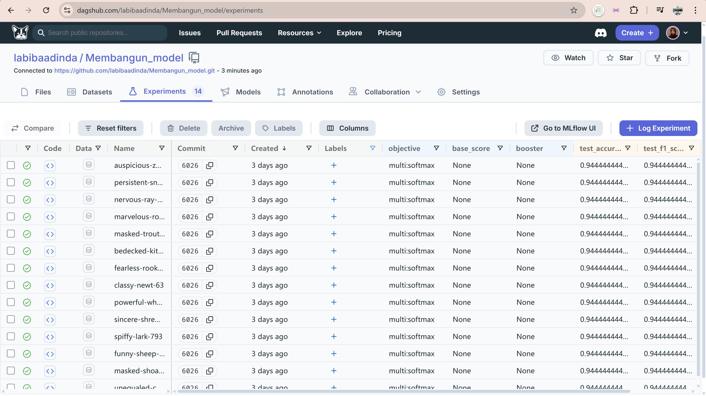

# Sleep Disorder Prediction Model Builder

Proyek ini bertujuan untuk membangun dan mengevaluasi model machine learning menggunakan dataset terkait gangguan tidur dengan menggunakan XGBoost. Proyek ini melibatkan penggunaan **MLflow** untuk pelacakan eksperimen, **GridSearchCV** untuk pencarian hyperparameter terbaik, serta **DagsHub** untuk log hasil eksperimen dan model.

## Struktur Proyek

```
Membangun_model/
├── modelling.py               # Script untuk melatih model dengan autolog MLflow
├── modelling_tuning.py        # Script untuk hyperparameter tuning dan manual logging
├── sleep-health_life-style_preprocessing.csv  # Dataset yang sudah diproses
├── screenshot_dashboard.jpg   # Screenshot dashboard dari DagsHub
├── screenshot_artifak.jpg     # Screenshot dari artefak model
├── requirements.txt           # Dependencies yang diperlukan
├── DagsHub.txt                # Tautan repositori DagsHub (untuk advanced)
```

## Deskripsi

### 1. **Modelling (modelling.py)**

Di file ini, kita menggunakan **XGBoost** untuk melatih model pada dataset yang telah diproses. **MLflow autolog** diaktifkan untuk secara otomatis melacak model dan metrik pelatihan. Ini memungkinkan integrasi yang mudah dengan **MLflow Tracking UI** untuk pelacakan eksperimen.

### 2. **Hyperparameter Tuning (modelling\_tuning.py)**

Pada file ini, kita mengimplementasikan **GridSearchCV** untuk mencari kombinasi hyperparameter terbaik menggunakan XGBoost. Proyek ini melibatkan **manual logging** dari metrik performa model menggunakan **MLflow** dan juga mengintegrasikannya dengan **DagsHub** untuk melacak hasil eksperimen secara lebih lanjut.

### 3. **Metrik yang Dilogging**

* **Accuracy**
* **Precision**
* **Recall**
* **F1-Score**

### 4. **Integrasi dengan DagsHub**

Proyek ini juga menggunakan **DagsHub** untuk pelacakan eksperimen secara online. Hasil eksperimen dan metrik juga dikirim ke DagsHub menggunakan **dagshub\_logger()** untuk pelaporan dan analisis lebih lanjut.

## Penggunaan

1. **Instal Dependencies**

   Pastikan untuk menginstal semua dependensi yang dibutuhkan dengan menjalankan perintah:

   ```bash
   pip install -r requirements.txt
   ```

2. **Latih Model (modelling.py)**

   Jalankan `modelling.py` untuk memulai pelatihan model menggunakan **XGBoost** dengan autolog:

   ```bash
   python modelling.py
   ```

3. **Tuning dan Pelatihan dengan Hyperparameter (modelling\_tuning.py)**

   Jalankan `modelling_tuning.py` untuk mengimplementasikan **GridSearchCV** dan mencari kombinasi hyperparameter terbaik.

   ```bash
   python modelling_tuning.py
   ```

4. **Lihat Hasil di DagsHub**

   Setelah eksperimen selesai, Anda dapat mengakses hasilnya di **DagsHub** melalui tautan yang diberikan di file `DagsHub.txt` atau klik link ini [Dagshub](https://dagshub.com/labibaadinda/Membangun_model).

## Evaluasi Hasil

Berikut adalah metrik evaluasi untuk model yang dilatih menggunakan dataset yang telah diproses dengan XGBoost Algorithm dan Hyperparameter Tuning GridSearchCV:

* **Best CV Accuracy:** 94.44%
* **Test Accuracy:** 94.44%
* **Precision:** 94.44%
* **Recall:** 94.44%
* **F1 Score:** 94.44%

## Screenshot

* Dashboard Dagshub

* Model Artifacts 


## Catatan

* Pastikan untuk memiliki file `.env` yang berisi kredensial **DagsHub\_USERNAME** dan **DagsHub\_TOKEN** untuk menghubungkan dengan DagsHub.

  ```env
  DAGSHUB_USERNAME=your_dagshub_username
  DAGSHUB_TOKEN=your_dagshub_token
  ```

